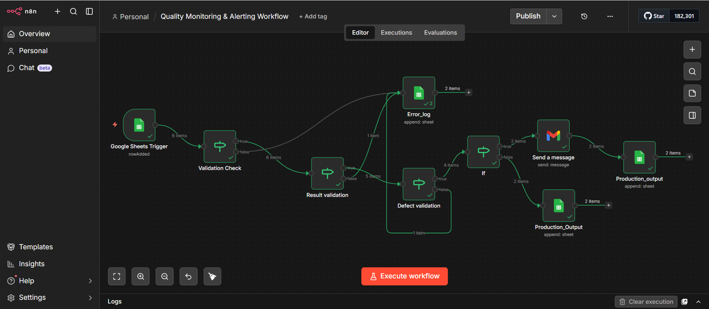
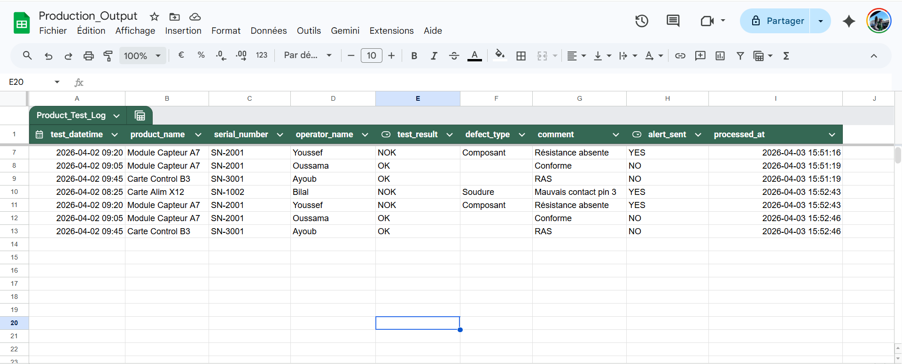
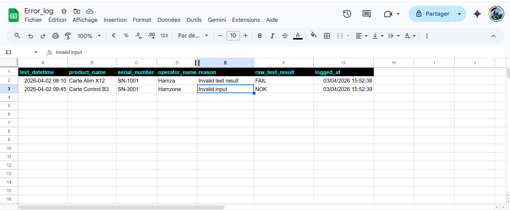

# Quality Monitoring & Alerting Workflow

## Overview
This project is an automated quality monitoring workflow built with n8n, Google Sheets, and Gmail.

It simulates a production quality control process by:
- validating input data
- detecting NOK test cases
- sending email alerts
- logging valid outputs
- logging validation errors

## Features
- Google Sheets trigger for new test entries
- Validation of serial number
- Validation of test result
- Validation of defect type for NOK cases
- Automatic email alert for NOK records
- Logging into `Production_Output`
- Logging into `Error_Log`
- Dashboard for monitoring workflow results

## Tools Used
- n8n
- Google Sheets
- Gmail

## Workflow Logic
1. A new row is added in `Production_Tests`
2. The workflow validates the serial number
3. The workflow validates the test result
4. The workflow validates the defect type for NOK cases
5. Invalid records are sent to `Error_Log`
6. Valid records continue to processing
7. NOK cases trigger an email alert
8. Processed records are saved into `Production_Output`
   
## Screenshots

### Workflow

### Production Output

### Error Log

## Author
Hamza Belhaissi
